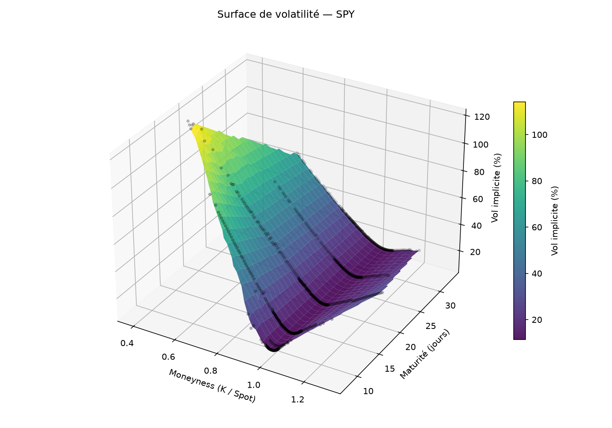
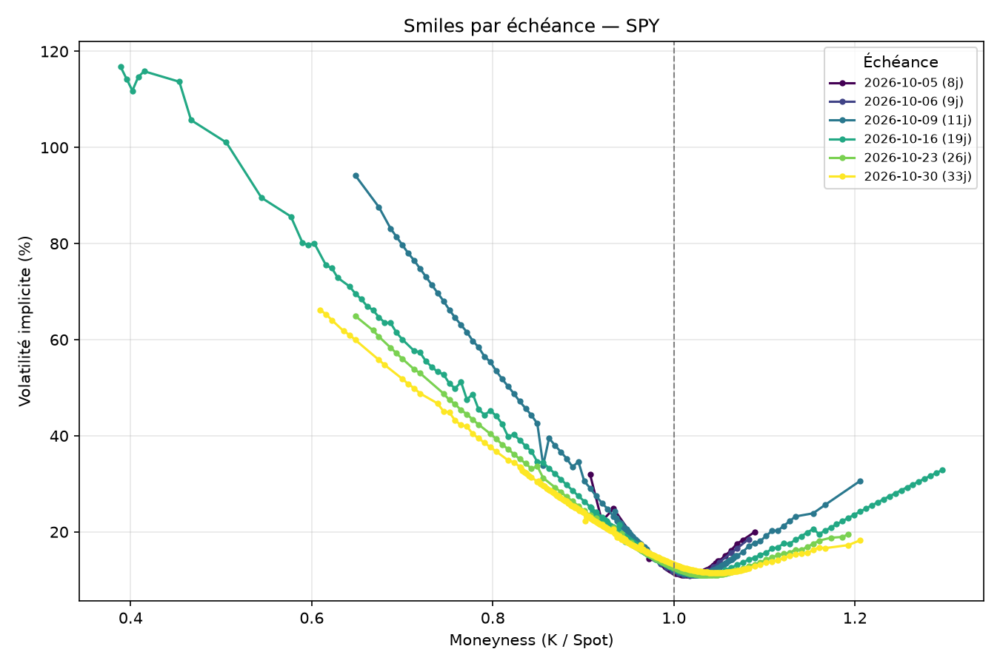

# Option Pricer & Volatility Surface

Bibliothèque Python de pricing d'options vanille (calls/puts), construite autour de
trois méthodes de valorisation indépendantes, du calcul des Grecques, et de la
reconstruction de la surface de volatilité implicite à partir de données de marché réelles.

L'objectif : ne pas se contenter de la formule fermée de Black-Scholes, mais la
confronter à des méthodes numériques (arbre binomial, Monte Carlo) et à ce que le
marché prix réellement d'où l'écart entre théorie (vol constante) et pratique
(smile/skew de volatilité).

## Ce que fait le projet

**Pricing** trois méthodes convergent vers le même prix pour une option européenne,
chacune avec ses propres cas d'usage :
- **Black-Scholes** : solution analytique fermée, instantanée, référence de calibration.
- **Arbre binomial (CRR)** : pricing pas à pas, seule méthode ici qui gère l'exercice
  anticipé (options américaines).
- **Monte Carlo** : simulation de trajectoires sous la mesure risque-neutre, avec
  réduction de variance par variates antithétiques et intervalle de confiance à 95 %
  sur le prix estimé.

**Grecques** — delta, gamma, vega, theta, rho calculés analytiquement en Black-Scholes.

**Volatilité implicite** — inversion numérique robuste (méthode de Brent) de la formule
de Black-Scholes pour retrouver la vol de marché à partir d'un prix observé.

**Surface de volatilité** — récupération de vraies chaînes d'options (Yahoo Finance)
sur plusieurs échéances, calcul de la vol implicite par strike, et deux visualisations :
smiles superposées par maturité, et surface 3D interpolée (moneyness × maturité × vol).

## Exemple de résultat

Sur SPY, la surface fait apparaître deux phénomènes bien documentés en pratique :
un **skew** marqué (vol plus élevée pour les strikes bas demande de protection à la
baisse) et une **structure par terme** qui s'aplatit avec la maturité (les échéances
courtes sont plus sensibles aux chocs de marché que les longues). C'est précisément
ce que Black-Scholes, qui suppose une vol constante, ne peut pas expliquer par
construction la surface met le modèle en défaut avec ses propres données.

## Structure

option-pricer/
├── pricer/
│   ├── black_scholes.py   # Prix analytique + Grecques
│   ├── binomial.py        # Arbre CRR — options européennes et américaines
│   ├── monte_carlo.py     # Simulation MC, variates antithétiques, IC95%
│   ├── implied_vol.py     # Inversion de Black-Scholes (méthode de Brent)
│   ├── smile.py           # Smile de vol sur une échéance (données réelles)
│   └── vol_surface.py     # Surface multi-échéances (smiles + 3D)
├── tests/
│   └── test_pricers.py    # Convergence, parité call-put, cohérence des Grecques
├── main.py
└── requirements.txt

## Auteur & Licence

Projet développé par M.Sastre.

Distribué sous licence MIT. Consulter le fichier `LICENSE` pour plus de détails.